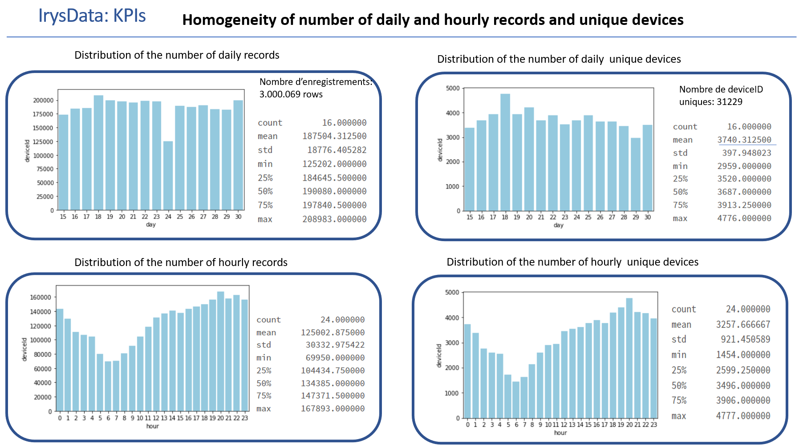
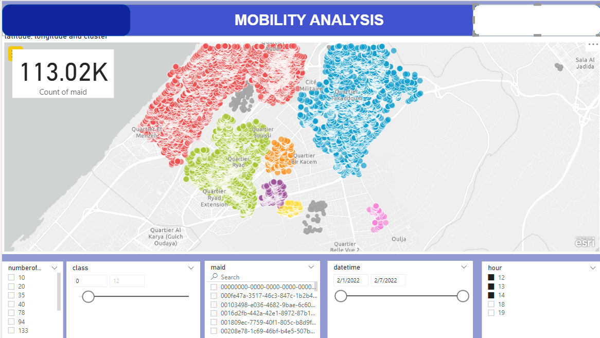
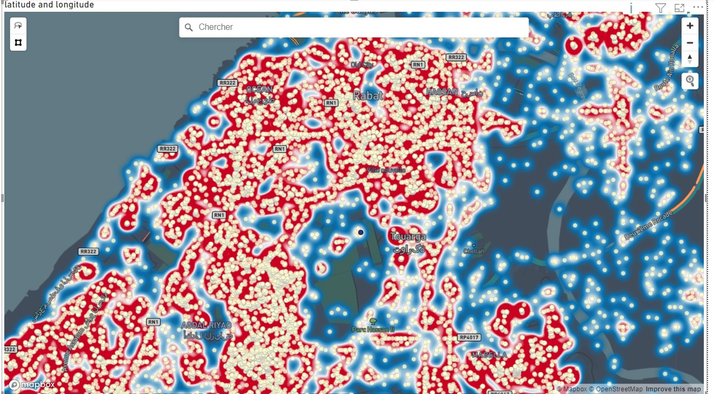
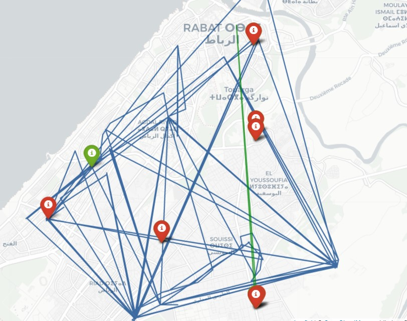
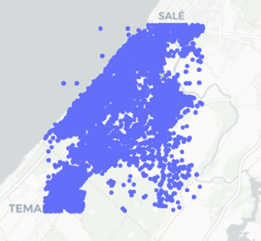
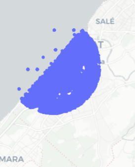
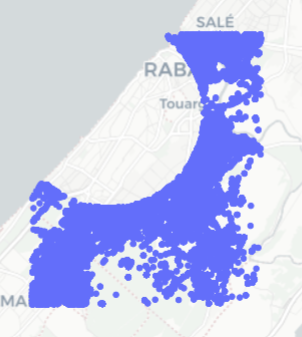

# Mobility Analysis project

## Overview
**Important Note :** I have done this project for a client and I have only shared the things that are not confidential.
This project is about analyzing urban mobility data to extract important insights and make data-driven decisions.

You can find many exciting things like how to process mobility data, create flow datasets, create heatmaps and find urban bottlenecks.

## Key Achievements

- Processed many GB of mobility data and extracted valuable insights.

  

- Built PowerBI Dashboards and visuals which helped the client take critical decisions.

  

- Built HeatMaps and analyzed mobility flow data.

  
  

- Performed a spatial analysis on mobility data, where the scope was limited to specific, pre-defined areas for an in-depth comparative study.

  
  
  

## Architecture of the project
You can find 3 notebook folders: 
- Exploratory data notebooks: Where I ingested the data and explored it.
- Preprocessing data notebooks: Where I cleaned each of the 3 data samples and visualized it
- Analysis notebooks: Where I analyzed the data to extract its quality and make dashboards and reports.

## List of Key Performance Indicators (KPIs)

| KPI Description                                    | Details                                              |
| -------------------------------------------------- | ---------------------------------------------------- |
| Total number of records                            | Number of records in the dataset                     |
| Number of records excluding outliers               | Records after removing outliers                      |
| Total unique device IDs                            | Count of unique device identifiers                   |
| Unique device IDs excluding outliers               | Unique device count after outlier removal            |
| Consistency in records distribution per day        | Uniformity of daily record counts                    |
| Average number of records per day                  | Average daily record count                           |
| Consistency in records distribution per hour       | Uniformity of hourly record counts                   |
| Average number of records per hour                 | Average hourly record count                          |
| Consistency in unique device IDs distribution per day | Uniformity in daily unique device ID counts         |
| Average number of unique device IDs per day        | Average daily unique device ID count                 |
|Average number of unique device IDs per day, excluding outliers.|        |
|Consistency in the distribution of unique device IDs per hour.|        |
|Average number of unique device IDs per hour.|        |
|Average number of unique device IDs per hour, excluding outliers.|        |
|Variability in the average interval between records for each device ID.|        |
|Variability in the average interval between records for each device ID, excluding outliers.|        |